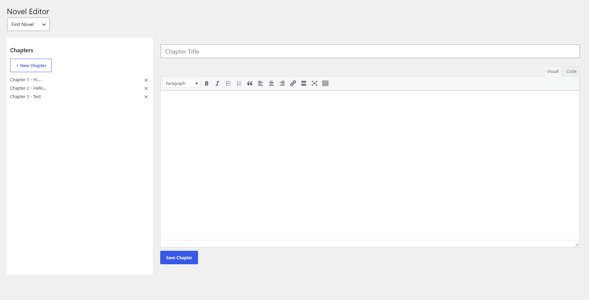
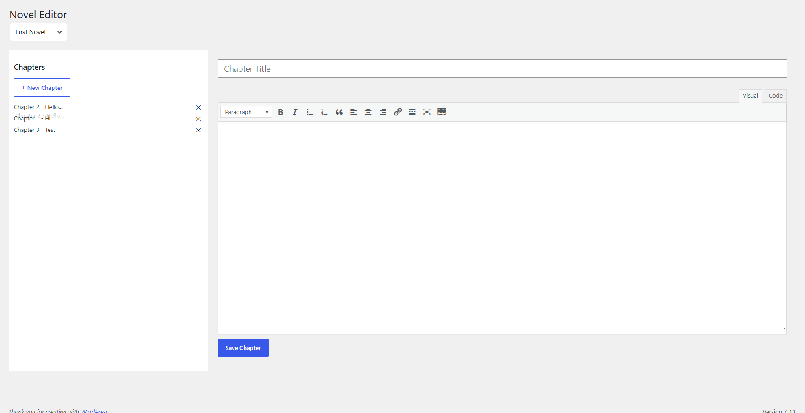

# 📚 LAGS Novel Manager

A custom WordPress plugin for managing and reading novels with a built-in chapter editor.

---

## 🚀 Features

### 🧩 Core

- Custom Post Types:
  - Novels
  - Chapters
- Chapter-to-novel relationship
- Chapter numbering system

---

### 🌐 Frontend

- Novel page with chapter list
- Chapter reader page
- Next / Previous navigation
- Custom templates
- Styled reading experience

---

### 🛠️ Admin Editor (Custom UI)

- Select a novel
- View all chapters
- Click to edit chapters
- WYSIWYG editor (WordPress editor)

---

### ⚡ Advanced Editor Features

- Autosave (every 10 seconds)
- Create new chapters instantly
- Edit chapter title & content
- Delete chapters
- Drag & drop reordering
- Real-time UI updates

---

## 📦 Installation

1. Copy plugin folder into:
   `/wp-content/plugins/`

2. Activate plugin in WordPress admin

3. Done ✅

---

## 🧑‍💻 Usage

### Create a Novel

- Go to **Novels → Add New**

### Add Chapters

- Use:
  - Default editor OR
  - Custom Novel Editor page

---

### Use Custom Editor

- Go to: **Novel Editor**
- Select a novel
- Manage chapters:
  - Create
  - Edit
  - Reorder
  - Delete

---

## 🧠 Future Improvements

- Autosave debounce
- Cover Image
- Chapter search
- Genres / taxonomy
- Reader settings (dark mode, font size)
- REST API support

---

## 📌 Notes

This plugin was built as a learning + production-ready project to create a custom content system inside WordPress.

---

## 📄 License

## MIT

## ✍️ Chapter Editor

## Drag And Drop

